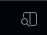
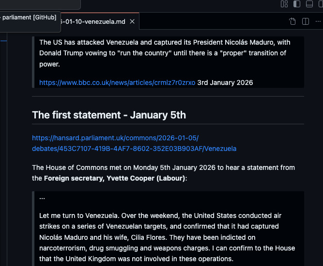
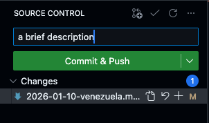

# Guide to writing for Parliament Simple

## Get access

1. Create a GitHub account <https://www.github.com>
2. Send Peter your GitHub username
3. Peter will grant access

## Write

1. Go to <https://github.dev/PeterWarrington/parliament>. Bookmark this!
2. Create a file in the _posts folder with the filename "YYYY-MM-DD-SHORT_TITLE.md" replacing accordingly. (Right click on the _posts folder, new file)
3. Copy and paste the following, replacing the values:
```
---
layout: post
title:  "Trump and Venezuela"
description: "Speeches following US military intervention in Venezuela and the capture of its President Nicolás Maduro."
author: Peter Warrington
---
```
4. Write! Use `>` for block quotes for all speeches and quotes. Remember to give sources. Use <https://hansard.parliament.uk> as main source.
5. Preview with the preview button on the right hand side:





## Upload

1. Once you've checked and want to upload, press this button on the sidebar: 
2. Type a brief description of your changes and press "Commit & Push": 
3. Your post will go online within a few minutes!